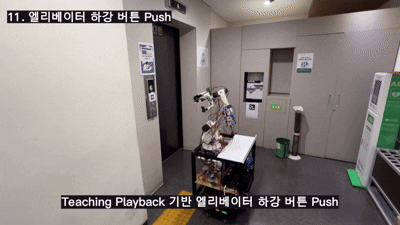
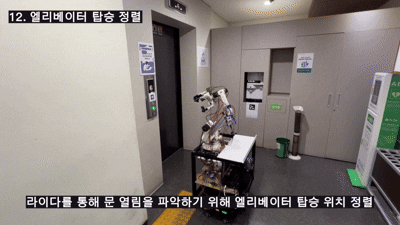
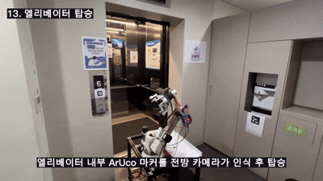

# 3지 그리퍼와 5축 로봇팔 기반 자율주행 시설 관리 로봇 'Scorpy' 개발

  
  
  
  
  
  
  

Scorpy는 모바일 로봇, 자체제작 로봇팔과 그리퍼를 통합하여 물체를 집고,
엘리베이터를 이용해 층간 이동한 뒤 지정 위치에 배송하고 출발지로 복귀하는 로봇 시스템입니다.

---

## Scorpy 시연

Scorpy가 물건을 집은 뒤 엘리베이터를 이용해 4층에서 5층으로 이동하고, 지정된 위치에 물건을 놓은 후 다시 4층 초기 위치로 복귀하는 전체 시연 과정입니다.

---

## 1. 물건 Pick

Scorpy가 출발 위치에 있는 물건을 집습니다.

* Teaching Playback 기반 로봇팔 시퀀스 실행
* 그리퍼 제어보드를 통한 물체 파지 수행

---

## 2. 4층 엘리베이터 버튼 앞 정렬

4층 엘리베이터 호출 버튼을 누르기 위해 버튼 앞에 정렬합니다.

* Nav2 기반 목표 위치 주행
* ArUco 마커 기반 정밀 위치 보정 수행

---

## 3. 엘리베이터 상승 버튼 Push

로봇팔을 이용해 엘리베이터 상승 호출 버튼을 누릅니다.

* ArUco 마커 위치 기반 버튼 좌표 계산
* Teaching Playback 기반 버튼 조작 시퀀스 수행

---

## 4. 엘리베이터 탑승 정렬

엘리베이터에 탑승하기 전 출입구 방향에 맞게 위치와 방향을 조정합니다.

* 엘리베이터 내부 진입 경로 계산
* 정밀 정렬 후 탑승 준비 상태 진입

---

## 5. 엘리베이터 탑승

엘리베이터 내부로 이동합니다.

* Nav2 경로 계획 기반 실내 이동
* 미션 FSM 기반 단계 전환 수행

---

## 6. 5층 버튼 Push

로봇팔을 이용해 엘리베이터 내부의 5층 버튼을 누릅니다.

* ArUco 마커 기반 버튼 인식
* 로봇팔 시퀀스를 이용한 층 선택 수행

---

## 7. 엘리베이터 하차

5층에 도착한 후 엘리베이터에서 하차합니다.

* 층 변경에 따른 맵 전환 수행
* 목적 층 주행 모드로 전환

---

## 8. 물건 Place 위치로 이동

물건을 전달할 지정 위치로 이동합니다.

* 5층 목적지까지 자율주행 수행
* 목표 위치 근처 정밀 정렬 수행

---

## 9. 물건 Pick & Place

운반한 물건을 지정된 위치에 내려놓습니다.

* Teaching Playback 기반 Place 동작 수행
* 그리퍼 개방 및 물체 전달 완료

---

## 10. 5층 엘리베이터 버튼 앞 정렬

4층으로 복귀하기 위해 5층 엘리베이터 호출 버튼 앞에 정렬합니다.

* 복귀 미션 FSM 실행
* ArUco 마커 기반 위치 보정 수행

---

## 11. 엘리베이터 하강 버튼 Push

로봇팔을 이용해 엘리베이터 하강 호출 버튼을 누릅니다.

* 버튼 위치 추정 및 자세 보정 수행
* 하강 호출 버튼 조작 시퀀스 실행

---

## 12. 엘리베이터 탑승 정렬

엘리베이터에 다시 탑승하기 위해 출입구 방향에 맞게 정렬합니다.

* 엘리베이터 진입 방향 정렬
* 주행 안정성을 위한 위치 재보정 수행

---

## 13. 엘리베이터 탑승

엘리베이터 내부로 이동합니다.

* 자율주행 기반 엘리베이터 재탑승
* 복귀 단계 FSM 진행

---

## 14. 4층 버튼 Push

로봇팔을 이용해 엘리베이터 내부의 4층 버튼을 누릅니다.

* 목표 층 버튼 인식 및 위치 계산
* 로봇팔 시퀀스 기반 버튼 입력 수행

---

## 15. 초기 위치 복귀

4층에 도착한 후 엘리베이터에서 하차하여 초기 위치로 복귀합니다.

* 4층 맵 복원 및 위치 재설정
* 초기 대기 위치까지 자율 복귀 수행

