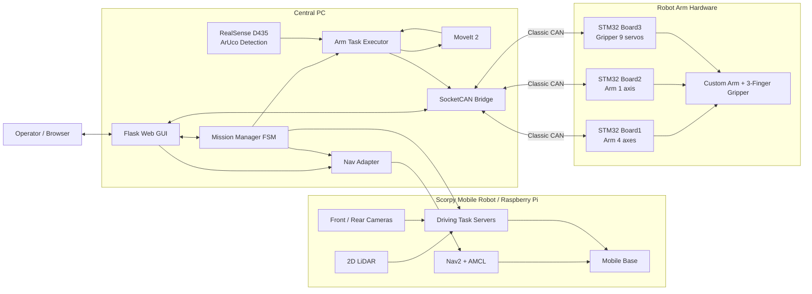

<div align="center">

# Scorpy

### ROS 2 기반 층간 자율주행 배송 로봇

**Nav2 · MoveIt 2 · ArUco · SocketCAN · STM32 · Flask Web GUI**

Scorpy는 모바일 로봇, 커스텀 로봇팔과 3지 그리퍼를 통합하여 물체를 집고,
엘리베이터를 이용해 층간 이동한 뒤 지정 위치에 배송하고 출발지로 복귀하는 로봇 시스템입니다.

</div>

<p align="center">
  
  
</p>

> 프로젝트와 최종 로봇의 이름은 **Scorpy**입니다.  
> 소스 코드 내부의 `vicpinky_*`, `roscue_*` 패키지명은 기존 ROS 2 실행 호환성을 위해 유지되어 있습니다.

---

## 1. 프로젝트 개요

Scorpy는 4층 402호에서 물체를 픽업한 뒤 5층 배송 장소까지 운반하고 다시 402호로 복귀하는 고정 데모 시나리오를 수행합니다. 중앙 서버의 Mission FSM이 자율주행, 엘리베이터 탑승·하차, 로봇팔 동작, 버튼 조작, 맵 전환을 하나의 ROS 2 Action 기반 미션으로 연결합니다.

### 최종 데모 시나리오

```text
4F 402
  → 로봇팔 Homing 및 준비 자세
  → ArUco ID 54 물체 인식·파지
  → 물체를 로봇 트레이에 적재
  → Nav2로 4층 엘리베이터 이동
  → ArUco 기반 정렬 및 호출 버튼 조작
  → 엘리베이터 탑승 후 5층 버튼 조작
  → 5층 도착 확인 및 맵 전환
  → object_place로 이동해 물체 배송
  → 엘리베이터를 이용해 4층 복귀
  → 4F 402로 귀환
```

현재 최종 Mission Manager는 검증된 시나리오를 위해 다음 입력만 허용합니다.

| 항목 | 값 |
|---|---|
| 픽업 위치 | `402` |
| 배송 위치 | `object_place` |
| 목적 층 | `5` |
| 대상 물체 | `object_1` |
| 배송 로봇팔 태스크 | `deliver_object_1_from_tray` |

---

## 2. 주요 기능

### 자율주행 및 층간 이동

- Nav2와 AMCL을 이용한 4층·5층 자율주행
- 층별 Occupancy Grid 맵 로딩과 `/initialpose` 재설정
- ArUco ID 20 기반 엘리베이터 앞 정렬
- LiDAR 기반 엘리베이터 문 열림 감지
- 전·후방 카메라를 이용한 탑승, 하차 및 층 마커 확인
- Odometry 기반 직진·회전 Action Server

### 로봇팔 및 그리퍼

- 커스텀 5축 로봇팔과 9축 3지 그리퍼 모델
- MoveIt 2 기반 자세 계획 및 ArUco 좌표 변환
- 물체 파지, 트레이 적재, 배송, 엘리베이터 버튼 누르기
- 저장 자세와 티칭 플레이백 방식의 수동 시퀀스 실행
- `plan_only`와 `hardware` 실행 모드를 통한 안전한 구동 분리

### CAN 통신

- Linux SocketCAN 기반 중앙 PC–STM32 제어보드 통신
- Board1: 로봇팔 4축
- Board2: 로봇팔 1축
- Board3: 그리퍼 서보 9축
- Enable, E-Stop, Homing, 위치 명령, 상태, 위치 피드백, ACK 처리
- 실제 CAN 인터페이스 `can0`와 개발용 가상 인터페이스 `vcan0` 지원

### 중앙 서버 및 Web GUI

- Flask 기반 브라우저 대시보드
- 전체 미션 시작·취소 및 FSM 진행 상태 표시
- 실시간 지도, 로봇 위치, Global/Local Path 표시
- 지도 위 드래그를 통한 초기 위치 설정
- 로봇팔·그리퍼 수동 제어 및 현재 Joint State 확인
- 현재 자세 저장, 수정, 삭제 및 저장 자세 순차 실행
- 제어보드 상태, 오류, 미션 이벤트 및 재연결 로그 동기화

---

## 3. 시스템 아키텍처



### 통신 구조

| 구간 | 방식 | 역할 |
|---|---|---|
| 중앙 PC ↔ Raspberry Pi | ROS 2 DDS | 미션 Action, Nav2 목표, 상태·센서·맵 데이터 공유 |
| 중앙 PC ↔ STM32 Board1/2/3 | SocketCAN / Classic CAN | 로봇팔·그리퍼 명령, 상태, ACK, 위치 피드백 |
| GUI ↔ 중앙 서버 | HTTP / Flask | 미션 실행, 수동 제어, 상태 및 로그 확인 |
| 카메라 ↔ 인식 노드 | ROS 2 Image / CameraInfo | ArUco 검출 및 Pose 계산 |

---

## 4. 하드웨어 구성

| 분류 | 구성 |
|---|---|
| 모바일 플랫폼 | Scorpy 주행 로봇, Raspberry Pi 기반 ROS 2 제어 |
| 주행 센서 | 2D LiDAR, 전방·후방 USB 카메라, Odometry |
| 매니퓰레이터 | 커스텀 5축 로봇팔 |
| 엔드 이펙터 | 9축 3지 그리퍼 |
| 비전 센서 | Intel RealSense D435 손목 카메라 |
| 제어보드 | STM32 Board1, Board2, Board3 |
| 통신 장치 | USB-to-CAN 또는 SocketCAN 호환 CAN 인터페이스 |
| 중앙 제어 | ROS 2 Jazzy가 설치된 PC |

---

## 5. 소프트웨어 스택

| 영역 | 기술 |
|---|---|
| Middleware | ROS 2 Jazzy, DDS, ROS 2 Action/Topic/Service |
| Navigation | Nav2, AMCL, Map Server, TF2 |
| Manipulation | MoveIt 2, URDF/Xacro, SRDF |
| Perception | OpenCV ArUco, cv_bridge, RealSense ROS |
| Embedded Interface | SocketCAN, Classic CAN, STM32 |
| Backend | Python, rclpy, Flask |
| Frontend | HTML, CSS, JavaScript, Canvas |
| Configuration | YAML |
| Test | pytest, ament lint, ROS 2 integration tests |

---

## 6. 저장소 구조

```text
Scorpy/
├── Scorpy_driving/                 # Raspberry Pi / 주행 로봇 워크스페이스
│   ├── vic_pinky/
│   │   ├── vicpinky_bringup/       # 모바일 베이스, LiDAR 및 TF bringup
│   │   ├── vicpinky_description/   # 주행 로봇 URDF
│   │   └── vicpinky_navigation/    # Nav2, AMCL 및 RViz 설정
│   ├── vicpinky_task_servers/      # 정렬, 문 감지, 탑승·하차, 맵 전환
│   ├── vicpinky_final_bringup/     # 주행 로봇 최종 통합 launch
│   └── vicpinky_interfaces/        # 공통 Action / Message
│
└── Scorpy_server/                  # 중앙 PC 워크스페이스
    ├── central_bringup/             # 중앙 서버 최종 통합 launch
    ├── mission_manager/             # 전체 Mission FSM 및 하위 Action 조정
    ├── vicpinky_nav_adapter/        # RunTask → NavigateToPose 변환
    ├── vicpinky_gui/                # Flask 기반 Web GUI
    ├── arm_can_bridge/              # SocketCAN–ROS 2 로봇팔 브리지
    ├── roscue_arm_description/      # 커스텀 로봇팔 URDF/Xacro
    ├── roscue_arm_moveit_config/    # MoveIt 2 설정
    ├── roscue_arm_pick/             # ArUco 인식 및 로봇팔 태스크 실행
    ├── mock_task_servers/           # 하드웨어 없는 통합 시험용 서버
    └── vicpinky_interfaces/         # 공통 Action / Message
```

> `Scorpy_driving`과 `Scorpy_server`는 서로 다른 장치에서 사용하는 **독립 ROS 2 워크스페이스**입니다.  
> 양쪽에 동일한 `vicpinky_interfaces`가 포함되어 있으므로 저장소 최상위에서 두 폴더를 한 번에 빌드하지 마십시오.

---

## 7. 주요 ROS 2 인터페이스

### Mission 및 주행 Action

| Action 이름 | 타입 | 역할 |
|---|---|---|
| `/mission/execute` | `ExecuteMission` | 전체 배송 미션 실행 |
| `/mission/ready_and_approach` | `RunTask` | 로봇팔 준비와 지연 직진 동시 조정 |
| `/nav/go_to` | `RunTask` | 위치 이름을 Nav2 목표 Pose로 변환 |
| `/dock/align` | `RunTask` | ArUco 기반 엘리베이터 정렬 |
| `/elevator/wait_door_open` | `RunTask` | LiDAR 기반 문 열림 대기 |
| `/elevator/board` | `RunTask` | 엘리베이터 탑승 |
| `/elevator/exit` | `RunTask` | 도착층 확인 후 하차 |
| `/floor/check` | `RunTask` | 층 마커 기반 도착 확인 |
| `/map/switch` | `RunTask` | 층별 맵 로드 및 초기 Pose 설정 |
| `/base/drive_straight` | `RunTask` | Odometry 기반 직진 |
| `/base/rotate` | `RunTask` | Odometry 기반 회전 |

### 로봇팔 Action

| Action 이름 | 역할 |
|---|---|
| `/arm/execute` | 설정된 로봇팔 태스크 실행 |
| `/arm/pick` | 물체 파지 |
| `/arm/place` | 물체 배치 |
| `/arm/press_button` | 엘리베이터 버튼 조작 |
| `/arm/homing` | 로봇팔 Homing |
| `/arm_controller/execute_joint_goal` | Board1/2 최종 Joint 목표 전송 |
| `/gripper_controller/follow_joint_trajectory` | Board3 그리퍼 목표 전송 |

### 상태 및 GUI Topic

| Topic | 역할 |
|---|---|
| `/mission/status` | 현재 FSM 상태, 진행률, 오류 |
| `/mission/event_log` | 미션 이벤트 로그 |
| `/robot/heartbeat` | 중앙 서버 Heartbeat |
| `/arm_board/status_log` | CAN 제어보드 상태 및 Fault |
| `/joint_states` | 로봇팔·그리퍼 현재 각도 |
| `/map` | 현재 층 Occupancy Grid |
| `/amcl_pose` | 로봇 추정 위치 |
| `/odom` | 주행 Odometry |
| `/plan`, `/local_plan` | Nav2 Global/Local Path |
| `/initialpose` | GUI에서 설정한 초기 위치 |
| `/tag/floor_id` | 감지된 층 번호 |

---

## 8. ArUco Marker 구성

| Marker ID | 용도 |
|---:|---|
| `4` | 4층 랜딩 마커 |
| `5` | 5층 랜딩 마커 |
| `10` | 엘리베이터 내부 / 탑승 기준 마커 |
| `20` | 엘리베이터 앞 주행 정렬 마커 |
| `50` | 4층 엘리베이터 호출 버튼 |
| `51` | 엘리베이터 내부 4층 버튼 |
| `52` | 엘리베이터 내부 5층 버튼 |
| `53` | 5층 엘리베이터 호출 버튼 |
| `54` | 최종 데모 물체 `object_1` |
| `55` | 추가 물체 `object_2` 설정용 |

최종 미션에서 실제로 허용되는 물체는 현재 `object_1`입니다.

---

## 9. 설치 및 빌드

### 9.1 공통 준비

두 장치에 ROS 2 Jazzy와 `colcon`, `rosdep`이 설치되어 있어야 합니다.

```bash
source /opt/ros/jazzy/setup.bash
sudo rosdep init 2>/dev/null || true
rosdep update
```

중앙 PC와 Raspberry Pi는 같은 ROS Domain을 사용해야 합니다.

```bash
export ROS_DOMAIN_ID=30
export ROS_LOCALHOST_ONLY=0
```

필요한 경우 위 내용을 각 장치의 `~/.bashrc`에 추가할 수 있습니다.

### 9.2 Raspberry Pi / 주행 로봇 빌드

```bash
cd ~/Scorpy/Scorpy_driving
source /opt/ros/jazzy/setup.bash

rosdep install --from-paths . --ignore-src -r -y
colcon build --symlink-install
source install/setup.bash
```

### 9.3 중앙 PC 빌드

```bash
cd ~/Scorpy/Scorpy_server
source /opt/ros/jazzy/setup.bash

rosdep install --from-paths . --ignore-src -r -y
colcon build --symlink-install
source install/setup.bash
```

---

## 10. 실행 방법

### 10.1 Raspberry Pi에서 Scorpy 주행 시스템 실행

```bash
cd ~/Scorpy/Scorpy_driving
source /opt/ros/jazzy/setup.bash
source install/setup.bash
export ROS_DOMAIN_ID=30
export ROS_LOCALHOST_ONLY=0

ros2 launch vicpinky_final_bringup final_robot.launch.py \
  front_video_device:=/dev/video0 \
  rear_video_device:=/dev/video2
```

기본 실행 항목은 다음과 같습니다.

- 모바일 베이스 및 LiDAR bringup
- 4층 맵을 사용하는 Nav2 및 AMCL
- 전방·후방 카메라
- 엘리베이터 정렬, 문 감지, 탑승·하차, 직진·회전, 맵 전환 서버

카메라 번호는 장치 환경에 따라 변경하십시오.

```bash
v4l2-ctl --list-devices
```

### 10.2 중앙 PC의 CAN 인터페이스 준비

실제 CAN bitrate는 STM32 펌웨어와 동일한 값으로 설정해야 합니다.

```bash
sudo ip link set can0 down 2>/dev/null || true
sudo ip link set can0 up type can bitrate <CAN_BITRATE>
ip -details link show can0
```

수신 상태 확인:

```bash
candump can0
```

정상 연결 시 Board1/2/3의 상태 프레임 `0x201`, `0x202`, `0x203`이 주기적으로 확인되어야 합니다. 실제 위치 피드백을 사용하는 경우 `0x301`, `0x302`, `0x303`도 확인합니다.

### 10.3 중앙 PC 최종 시스템 실행

```bash
cd ~/Scorpy/Scorpy_server
source /opt/ros/jazzy/setup.bash
source install/setup.bash
export ROS_DOMAIN_ID=30
export ROS_LOCALHOST_ONLY=0

ros2 launch central_bringup final_system.launch.py \
  can_interface:=can0 \
  execution_mode:=hardware \
  launch_depth_camera:=true \
  gui_host:=0.0.0.0 \
  gui_port:=8080
```

실행되는 주요 구성은 다음과 같습니다.

- Robot State Publisher와 MoveIt 2 `move_group`
- 로봇팔·그리퍼 SocketCAN Bridge
- ArUco Perception과 RealSense D435
- 로봇팔 Task Executor
- Nav Adapter
- Mission Manager
- Flask Web GUI

### 10.4 GUI 접속 및 미션 시작

중앙 PC 또는 같은 네트워크의 장치에서 다음 주소에 접속합니다.

```text
http://<CENTRAL_PC_IP>:8080
```

GUI 기본 미션 값:

```text
Pickup       : 402
Delivery     : object_place
Target Floor : 5
Object       : object_1
Arm Task     : deliver_object_1_from_tray
```

1. Driving Map에서 **Set Pose**를 선택합니다.
2. 지도 위에서 로봇의 위치와 방향을 드래그해 `/initialpose`를 발행합니다.
3. 모든 제어보드와 Action Server 상태를 확인합니다.
4. **Start**를 눌러 전체 미션을 시작합니다.
5. 비상 상황에서는 GUI의 **Cancel** 또는 별도 E-Stop 절차를 사용합니다.

### 10.5 터미널에서 미션 실행

```bash
ros2 run mission_manager send_mission \
  --mission-id demo_001 \
  --pickup-location 402 \
  --delivery-location object_place \
  --target-floor 5 \
  --object object_1 \
  --arm-task-name deliver_object_1_from_tray
```

상태 확인:

```bash
ros2 topic echo /mission/status
ros2 topic echo /mission/event_log
ros2 topic echo /arm_board/status_log
ros2 topic echo /joint_states
```

---

## 11. 안전한 시험 모드

### 로봇팔 Plan-only 실행

실제 모터를 움직이지 않고 설정과 노드 연결을 점검할 때 사용합니다.

```bash
sudo modprobe vcan
sudo ip link add dev vcan0 type vcan 2>/dev/null || true
sudo ip link set vcan0 up

ros2 launch central_bringup arm_hardware_bringup.launch.py \
  can_interface:=vcan0 \
  execution_mode:=plan_only \
  use_rviz:=true
```

`plan_only` 모드는 실제 동작 Goal을 거절하도록 설계되어 있습니다.

### 주행 전용 층간 이동 시험

로봇팔 없이 주행과 엘리베이터 구간만 검증할 때 사용합니다.

중앙 PC:

```bash
ros2 launch central_bringup driving_only_system.launch.py
```

수동 안전 확인 Action이 필요한 단계에서는 별도 터미널에서 다음 노드를 실행합니다.

```bash
ros2 run mission_manager operator_confirm_console
```

### Mock Action 통합 시험

```bash
ros2 launch central_bringup bringup_mock.launch.py
```

---

## 12. 주요 설정 파일

| 파일 | 역할 |
|---|---|
| `Scorpy_server/mission_manager/config/mission_flow.yaml` | 전체 최종 Mission FSM |
| `Scorpy_server/mission_manager/config/action_servers.yaml` | 하위 Action 이름, Timeout, Retry |
| `Scorpy_server/mission_manager/config/locations.yaml` | 층별 위치 및 마커 설정 |
| `Scorpy_driving/vicpinky_task_servers/config/nav_points.yaml` | Nav2 목적지 좌표 |
| `Scorpy_driving/vicpinky_task_servers/config/floor_markers.yaml` | 층 마커, 맵 파일, 초기 Pose |
| `Scorpy_server/arm_can_bridge/config/arm_can_bridge.yaml` | Board–Joint 매핑, 한계값, CAN 설정 |
| `Scorpy_server/arm_can_bridge/config/retry_timeout.yaml` | CAN 재시도 및 Timeout |
| `Scorpy_server/roscue_arm_pick/config/task_sequence.yaml` | Pick, Place, Button 태스크 순서 |
| `Scorpy_server/roscue_arm_pick/config/fixed_poses.yaml` | 로봇팔 티칭 자세 |
| `Scorpy_server/roscue_arm_pick/config/gripper_profiles.yaml` | 물체별 그리퍼 각도와 파지력 |
| `Scorpy_server/roscue_arm_pick/config/aruco_targets.yaml` | 버튼·물체 마커 Offset |

### 최종 주행 파라미터

| 항목 | 값 |
|---|---:|
| 엘리베이터 정렬 거리 | `1.27 m` |
| 정렬 유지 시간 | `3.0 s` |
| 정렬 후 직진 지연 | `2.0 s` |
| 엘리베이터 접근 직진 | `0.27 m` |
| 접근 속도 | `0.15 m/s` |
| 엘리베이터 방향 회전 | 좌 `80°` |
| 탑승 정지 거리 | `50 cm` |
| 하차 정지 거리 | `70 cm` |
| 맵 전환 후 Nav2 대기 | `3.0 s` |

---

## 13. CAN Protocol 요약

| 방향 | CAN ID | 의미 |
|---|---:|---|
| PC → 전체 보드 | `0x001` | Emergency Stop |
| PC → 전체 보드 | `0x010` | Enable |
| PC → 보드 | `0x020` | Homing |
| PC → Board3 | `0x023` | Gripper Home |
| PC → 전체 보드 | `0x030` | Error Clear |
| PC → Board1 | `0x101` | Arm Position Command |
| PC → Board2 | `0x102` | Arm Position Command |
| PC → Board3 | `0x103` | Gripper Servo Command |
| Board1/2/3 → PC | `0x201`–`0x203` | Board Status |
| Board1/2/3 → PC | `0x301`–`0x303` | Position Feedback |
| Board1/2 → PC | `0x401`, `0x402` | V3 ACK |

Board1/2의 완료 판단은 보드 상태, 오류, 이동 모터, Homing Mask, 최신 상태 여부를 함께 확인합니다. Board3는 9개 Servo 명령을 staging한 뒤 상태와 피드백을 조합해 그리퍼 상태를 관리합니다.

---

## 14. 테스트

저장소에는 CAN 프로토콜, Mission FSM, 안전 로직, Nav Adapter, GUI 저장 자세 API 등을 검증하는 테스트 코드가 포함되어 있습니다.

각 워크스페이스에서 실행합니다.

```bash
colcon test --event-handlers console_direct+
colcon test-result --verbose
```

특정 패키지만 시험하는 예시:

```bash
colcon test --packages-select arm_can_bridge mission_manager vicpinky_gui
colcon test-result --verbose
```

---

## 15. 현재 제한사항 및 주의사항

- `fixed_poses.yaml`의 수치 통합은 완료되었지만 `field_verified: false`입니다. 실제 로봇에서 버튼, Pick, Place 자세를 반드시 저속으로 재검증해야 합니다.
- 최종 Mission Manager는 현재 `402 → object_place → 402`, 5층, `object_1` 시나리오만 허용합니다.
- Marker ID 55의 `object_2` 설정은 존재하지만 최종 미션에는 아직 연결되지 않았습니다.
- 엘리베이터 내부 Marker ID 10의 초기 Pose는 placeholder이므로 층별 맵 전환은 랜딩 마커의 고정 Pose를 사용합니다.
- `arm_task_server` 패키지는 호환성 테스트용 Deprecated 패키지입니다. 실제 실행에서는 `roscue_arm_pick/task_executor_node`를 사용하며 두 패키지를 동시에 실행하면 안 됩니다.
- 실제 하드웨어 실행 전 CAN 종단저항, 공통 GND, 전압 레벨, 보드 상태 프레임, E-Stop 동작을 확인해야 합니다.
- 로봇 주변에 작업자를 배치하고 초기 시험은 낮은 속도와 충분한 안전거리를 확보한 상태에서 진행하십시오.

---

## 16. 문제 해결

### PC와 Raspberry Pi에서 ROS 2 Topic이 보이지 않는 경우

```bash
echo $ROS_DOMAIN_ID
echo $ROS_LOCALHOST_ONLY
ros2 node list
```

두 장치의 `ROS_DOMAIN_ID`가 동일하고 `ROS_LOCALHOST_ONLY=0`인지 확인합니다.

### Nav2에서 다른 층 맵이 보이는 경우

```bash
ros2 service list | grep load_map
ros2 topic echo /map --once
ros2 topic echo /mission/status
```

`/map/switch` 완료 후 새 `/map` 데이터가 수신되는지 확인하고, `floor_markers.yaml`의 맵 경로와 초기 Pose를 점검합니다.

### CAN 상태가 수신되지 않는 경우

```bash
ip -details -statistics link show can0
candump can0
```

- CAN bitrate 일치 여부
- CAN_H/CAN_L 배선
- 양 끝 120 Ω 종단저항
- 공통 GND
- 보드 Enable 및 전원
- ACK Error 또는 Bus-off 상태

를 확인합니다.

### ArUco가 검출되지 않는 경우

```bash
ros2 topic hz /camera/camera/color/image_raw
ros2 topic echo /camera/camera/color/camera_info --once
ros2 topic echo /detected_marker_id
```

카메라 Topic, 조명, 초점, 마커 크기, 인쇄 품질, 시야각 및 `target_marker_ids` 설정을 확인합니다.

---

## 17. 프로젝트 핵심 성과

- ROS 2 Action 기반 Mission FSM으로 주행, 엘리베이터, 로봇팔 작업을 하나의 미션으로 통합
- 4층과 5층의 서로 다른 Nav2 맵을 실시간으로 전환하는 층간 자율주행 구현
- ArUco와 LiDAR를 결합한 엘리베이터 정렬, 문 감지, 탑승·하차 로직 구현
- 3개의 STM32 제어보드와 중앙 서버를 연결하는 커스텀 CAN 프로토콜 및 SocketCAN Bridge 구현
- 로봇팔·그리퍼 수동 제어, 티칭 자세 저장, 미션 상태와 주행 맵을 통합한 Flask Web GUI 구현

---

<div align="center">

**Scorpy — Autonomous Inter-Floor Delivery Robot**

</div>
