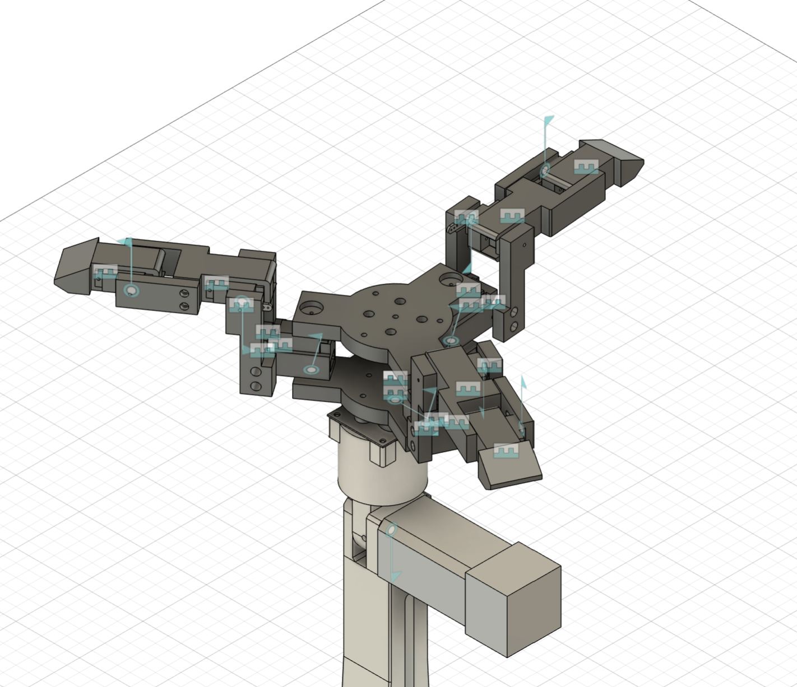

# gripper_description — 3-Finger Gripper Description

<p align="center">
  
</p>

## Overview

| Property | Value |
|---|---|
| Type | 3-Finger Gripper |
| Actuator | Servo Motor |
| Structure | 3D-Printed Lightweight Design |
| Fingertip Finish | Silicone Sheet |
| Main Purpose | Stable Object Grasping |
| Mesh Format | STL |
| Detailed URDF / Assembly | `roscue_arm_description` |

## Table of Contents

- [Design Concept](#design-concept)
- [Package Structure](#package-structure)
- [Directory Description](#directory-description)
- [Design Resources](#design-resources)
- [Related Package](#related-package)

## Design Concept

This package contains the mechanical design resources for the custom **3-Finger Gripper** used in the ROScue project.

The gripper was designed with a focus on **lightweight structure** and **stable grasping performance**.  
Compared with a conventional two-finger gripper, the three-finger configuration allows the object to be supported from multiple directions, improving grasp stability for objects with various shapes.

To increase friction during grasping, **silicone sheets** are attached to the fingertip contact surfaces to reduce object slippage.

## Package Structure

```text
gripper_description
├── docs
│   ├── servo_angle_limits.txt
│   └── servo_id_mapping.txt
├── images
│   ├── render
│   ├── real
│   └── dimensions
├── meshes
│   └── stl
│       ├── end_effector
│       ├── shaft
│       └── stm_case
└── README.md
```

## Directory Description

| Directory | Description |
|---|---|
| `docs/` | Servo ID mapping, servo origin values, joint angle limits, and dimension references |
| `images/` | CAD render images, real gripper photos, and dimension screenshots |
| `meshes/stl/` | STL files for each gripper component - end_effctor / various shaft / stm_case |

## Design Resources

### Mesh Files

The `meshes/stl/` directory contains STL files for the gripper parts.

### Images

The `images/` directory contains visual references such as:

- CAD rendering images
- Real gripper photos
- Overall dimension images
- Finger dimension images
- Base and joint dimension images

### Documents

The `docs/` directory contains:

- Servo ID mapping
- Servo home position values
- Joint motion limits
- Mechanical dimension references

## Notes

This folder is intended as a lightweight reference package for the gripper design.  
Detailed ROS2-based robot modeling and integration are handled in the related arm description package.

## Related Package

This package only provides **mechanical design resources** for the custom gripper.

For detailed robot descriptions, including **URDF**, **assembly configuration**, **MoveIt setup**, and robot integration, please refer to:

👉 [roscue_arm_description](https://github.com/cheeserust/final_project/tree/main/roscue_arm_description)

## Credits

### Original Design

The STM32 NUCLEO-L476RG enclosure was obtained from the following public repository.

- Source: https://makerworld.com/ko/models/876518-nucleo-stm32-housing-casing?from=search#profileId-829560
### Custom Design

The following components were designed by our team:

- Gripper Base
- Finger Links
- Servo Housing
- Shaft

## Design Software

- CAD Software: **Autodesk Fusion 360**
- Mesh Format: **STL**

All mechanical models in this package were created using Fusion 360 for the ROScue Project.

*Fusion 360 is a registered trademark of Autodesk, Inc. This project is an independent academic work and has no affiliation with Autodesk.*