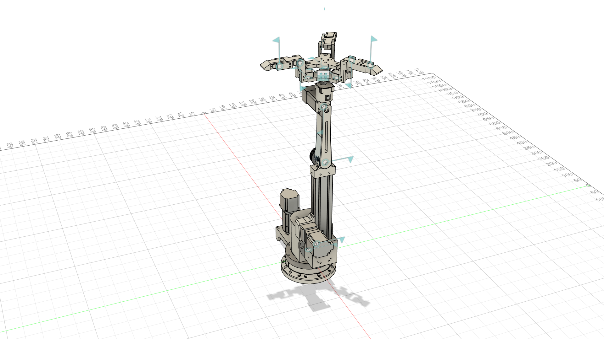

# roscue_arm — Robot Description



## Overview

| Property | Value |
|----------|-------|
| Total mass | 8.739 kg |
| Links | 15 |
| Joints | 14 (14 movable) |
| Assemblies | 11 |
| Root link | `base_link` |

## Table of Contents

- [Kinematic Tree](#kinematic-tree)
- [Link Properties](#link-properties)
- [Joint Properties](#joint-properties)
- [Assembly Breakdown](#assembly-breakdown)
- [Quick Start (ROS 2)](#quick-start-ros-2)
- [Files](#files)

## Kinematic Tree

```
base_link
  └─ base_joint [continuous]
    first_link [BAKE]
      └─ arm_joint_1 [continuous]
        second_link [BAKE]
          └─ arm_joint_2 [continuous]
            third_link [BAKE]
              └─ arm_joint_3 [continuous]
                fourth_link [BAKE]
                  └─ arm_joint_4 [continuous]
                    gripper_base_link [BAKE]
                      └─ finger_1_base_joint [continuous]
                        hand_finger_link_1_1_1 [BAKE]
                          └─ finger_1_middle_joint [continuous]
                            finger1_link_1_1 [BAKE]
                              └─ finger_1_tip_joint [continuous]
                                finger1_link_2_1 [BAKE]
                      └─ finger_2_base_joint [continuous]
                        hand_finger_link_2_1_1 [BAKE]
                          └─ finger_2_middle_joint [continuous]
                            finger2_link_1_1 [BAKE]
                              └─ finger_2_tip_joint [continuous]
                                finger2_link_2_1 [BAKE]
                      └─ finger_3_base_joint [continuous]
                        hand_finger_link_3_1_1 [BAKE]
                          └─ finger_3_middle_joint [continuous]
                            finger3_link_1_1 [BAKE]
                              └─ finger_3_tip_joint [continuous]
                                finger3_link_2_1 [BAKE]
```

## Link Properties

| Link | Mass (kg) | Material | Collision | Bodies |
|------|-----------|----------|-----------|--------|
| `base_link` | 2.0600 | Aluminum_6061 | visual_reuse | 6 |
| `finger1_link_1_1` | 0.0422 | pla_plus | visual_reuse | 2 |
| `finger1_link_2_1` | 0.0293 | pla_plus | visual_reuse | 1 |
| `finger2_link_1_1` | 0.0422 | pla_plus | visual_reuse | 2 |
| `finger2_link_2_1` | 0.0293 | pla_plus | visual_reuse | 1 |
| `finger3_link_1_1` | 0.0422 | pla_plus | visual_reuse | 2 |
| `finger3_link_2_1` | 0.0293 | pla_plus | visual_reuse | 1 |
| `first_link` | 2.7404 | Aluminum_6061 | visual_reuse | 7 |
| `fourth_link` | 0.2117 | pla_plus | visual_reuse | 3 |
| `gripper_base_link` | 0.1984 | Steel | visual_reuse | 1 |
| `hand_finger_link_1_1_1` | 0.0467 | pla_plus | visual_reuse | 1 |
| `hand_finger_link_2_1_1` | 0.0467 | pla_plus | visual_reuse | 1 |
| `hand_finger_link_3_1_1` | 0.0467 | pla_plus | visual_reuse | 1 |
| `second_link` | 2.1214 | Aluminum_6061 | visual_reuse | 7 |
| `third_link` | 1.0528 | pla_plus | visual_reuse | 4 |

## Joint Properties

| Joint | Type | Parent → Child | Axis | Limits |
|-------|------|---------------|------|--------|
| `arm_joint_1` | continuous | `first_link` → `second_link` | (-0,-0,-1) | — |
| `arm_joint_2` | continuous | `second_link` → `third_link` | (0,1,0) | — |
| `arm_joint_3` | continuous | `third_link` → `fourth_link` | (0,1,0) | — |
| `arm_joint_4` | continuous | `fourth_link` → `gripper_base_link` | (-0,0,1) | — |
| `base_joint` | continuous | `base_link` → `first_link` | (0,0,-1) | — |
| `finger_1_base_joint` | continuous | `gripper_base_link` → `hand_finger_link_1_1_1` | (0,0,1) | — |
| `finger_1_middle_joint` | continuous | `hand_finger_link_1_1_1` → `finger1_link_1_1` | (-0,-1,0) | — |
| `finger_1_tip_joint` | continuous | `finger1_link_1_1` → `finger1_link_2_1` | (-0,-1,0) | — |
| `finger_2_base_joint` | continuous | `gripper_base_link` → `hand_finger_link_2_1_1` | (0,-0,1) | — |
| `finger_2_middle_joint` | continuous | `hand_finger_link_2_1_1` → `finger2_link_1_1` | (-0,-1,0) | — |
| `finger_2_tip_joint` | continuous | `finger2_link_1_1` → `finger2_link_2_1` | (0,-1,0) | — |
| `finger_3_base_joint` | continuous | `gripper_base_link` → `hand_finger_link_3_1_1` | (0,-0,1) | — |
| `finger_3_middle_joint` | continuous | `hand_finger_link_3_1_1` → `finger3_link_1_1` | (0,-1,0) | — |
| `finger_3_tip_joint` | continuous | `finger3_link_1_1` → `finger3_link_2_1` | (0,-1,0) | — |

## Assembly Breakdown

### finger_1_base_link

- **Links**: hand_finger_link_1_1_1
- **Total mass**: 0.047 kg

### finger_1_middle_link

- **Links**: finger1_link_1_1
- **Total mass**: 0.042 kg

### finger_1_tip_link

- **Links**: finger1_link_2_1
- **Total mass**: 0.029 kg

### finger_2_base_link

- **Links**: hand_finger_link_2_1_1
- **Total mass**: 0.047 kg

### finger_2_middle_link

- **Links**: finger2_link_1_1
- **Total mass**: 0.042 kg

### finger_2_tip_link

- **Links**: finger2_link_2_1
- **Total mass**: 0.029 kg

### finger_3_base_link

- **Links**: hand_finger_link_3_1_1
- **Total mass**: 0.047 kg

### finger_3_middle_link

- **Links**: finger3_link_1_1
- **Total mass**: 0.042 kg

### finger_3_tip_link

- **Links**: finger3_link_2_1
- **Total mass**: 0.029 kg

### gripper_base_link2

- **Links**: 
- **Total mass**: 0.000 kg

### roscue_arm

- **Links**: first_link, second_link, base_link, third_link, fourth_link, gripper_base_link
- **Total mass**: 8.385 kg

## Quick Start (ROS 2)

```bash
# 1. Copy package to your ROS 2 workspace
cp -r roscue_arm_description ~/ros2_ws/src/

# 2. Build
cd ~/ros2_ws
colcon build --packages-select roscue_arm_description
source install/setup.bash

# 3. Visualize in RViz2
ros2 launch roscue_arm_description display.launch.py

# 4. Validate URDF structure
check_urdf install/roscue_arm_description/share/roscue_arm_description/urdf/roscue_arm.urdf

# 5. Print kinematic tree
urdf_to_graphviz install/roscue_arm_description/share/roscue_arm_description/urdf/roscue_arm.urdf
```

**Joint control**: The launch file includes `joint_state_publisher_gui` —
use the sliders to move revolute/prismatic joints in RViz2.

**Topic inspection**:
```bash
# See published joint states
ros2 topic echo /joint_states

# See robot description parameter
ros2 param get /robot_state_publisher robot_description
```

## Files

| Path | Description |
|------|-------------|
| `urdf/roscue_arm.urdf.xacro` | Top-level xacro (entry point) |
| `urdf/roscue_arm.urdf` | Flat URDF (for validation) |
| `urdf/assemblies/` | Per-assembly xacro macros |
| `meshes/` | Visual (OBJ) and collision (STL) meshes |
| `launch/display.launch.py` | Launch robot_state_publisher, RViz, and generated controllers |
| `config/joint_state.yaml` | Joint state publisher config |
| `config/ros2_controllers.yaml` | Generated ros2_control controller manager config |
| `robot_data.yaml` | Supplementary data (beyond URDF) |
| `docs/transforms.md` | Transformation matrices (KaTeX) |

## Customizing

Assemblies tagged `!dummy_` are designed to be swapped out. To replace one:

1. Create your replacement as a xacro macro with the same interface
2. Place it in `urdf/assemblies/`
3. Update the `<xacro:include>` in `urdf/roscue_arm.urdf.xacro`
4. Update meshes in `meshes/<your_assembly>/`

The xacro prefix system (`${prefix}`) ensures link names stay unique
when multiple instances of the same assembly are used.

---
*Generated by Fusion URDF/XACRO Exporter v3.0.0*